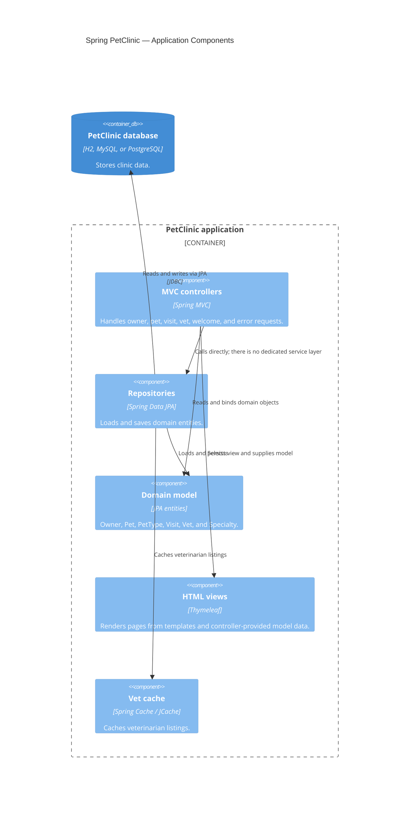

# Spring PetClinic — C4 Components

```mermaid
C4Component
  title Spring PetClinic — Application Components

  ContainerDb(database, "PetClinic database", "H2, MySQL, or PostgreSQL", "Stores clinic data.")

  Container_Boundary(app, "PetClinic application") {
    Component(controllers, "MVC controllers", "Spring MVC", "Handles owner, pet, visit, vet, welcome, and error requests.")
    Component(repositories, "Repositories", "Spring Data JPA", "Loads and saves domain entities.")
    Component(domain, "Domain model", "JPA entities", "Owner, Pet, PetType, Visit, Vet, and Specialty.")
    Component(views, "HTML views", "Thymeleaf", "Renders pages from templates and controller-provided model data.")
    Component(cache, "Vet cache", "Spring Cache / JCache", "Caches veterinarian listings.")
  }

  Rel(controllers, repositories, "Calls directly; there is no dedicated service layer")
  Rel(controllers, domain, "Reads and binds domain objects")
  Rel(controllers, views, "Selects view and supplies model")
  Rel(repositories, domain, "Loads and persists")
  Rel(repositories, database, "Reads and writes via JPA", "JDBC")
  Rel(repositories, cache, "Caches veterinarian listings")
```

The application is a server-rendered MVC application, not a separate frontend SPA or a REST-first API.
