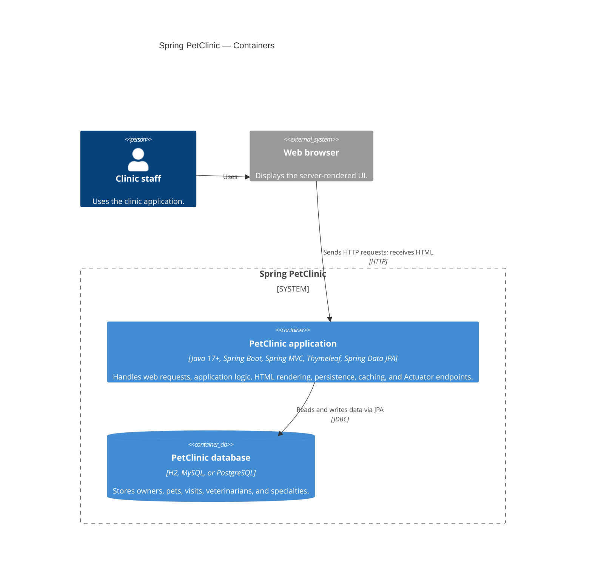

# Spring PetClinic — C4 Containers

```mermaid
C4Container
  title Spring PetClinic — Containers

  Person(staff, "Clinic staff", "Uses the clinic application.")
  System_Ext(browser, "Web browser", "Displays the server-rendered UI.")

  System_Boundary(petclinic, "Spring PetClinic") {
    Container(app, "PetClinic application", "Java 17+, Spring Boot, Spring MVC, Thymeleaf, Spring Data JPA", "Handles web requests, application logic, HTML rendering, persistence, caching, and Actuator endpoints.")
    ContainerDb(database, "PetClinic database", "H2, MySQL, or PostgreSQL", "Stores owners, pets, visits, veterinarians, and specialties.")
  }

  Rel(staff, browser, "Uses")
  Rel(browser, app, "Sends HTTP requests; receives HTML", "HTTP")
  Rel(app, database, "Reads and writes data via JPA", "JDBC")
```

The database is H2 by default; MySQL and PostgreSQL are supported through Spring profiles.
